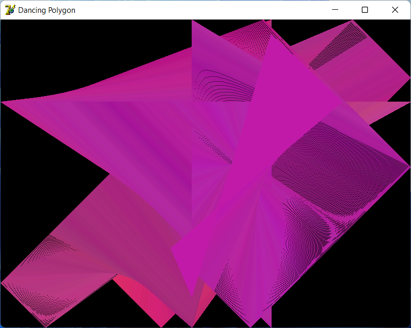

# DancingPolygon
Some bullshEEt program I made with Borland Delphi 7.\
It draws some nonunderstable but very fun and interesting pseudo-3D graphic shapes. It can also export your creatures in BMP format.\
The program is Freeware and Open-source, because I created it just for fun. Compatible with Windows XP..11\
Enjoy! :D\
\
*P.S.: Please keep in mind that I had stopped developing Dancing Polygon, that's why there will be no technical support for this program.*\
\
Небольшая хренотень, написанная с -1 на Borland Delphi 7.\
Она замечательна (нет) тем, что рисует различные прикольные псевдо-3Dшные фигурки. А ещё она умеет экспортировать получившиеся шедевры в картинки формата BMP.\
Программа абсолютно бесплатна и к тому же с открытым исходным кодом, ибо создана чисто по приколу. Есть совместимость с Windows XP..11.\
Приятного использования! :D\
\
*P.S.: Обращаю ваше внимание, что разработка Dancing Polygon прекращена, поэтому никакой технической поддержки для этой программы нет и не будет.*\
\

